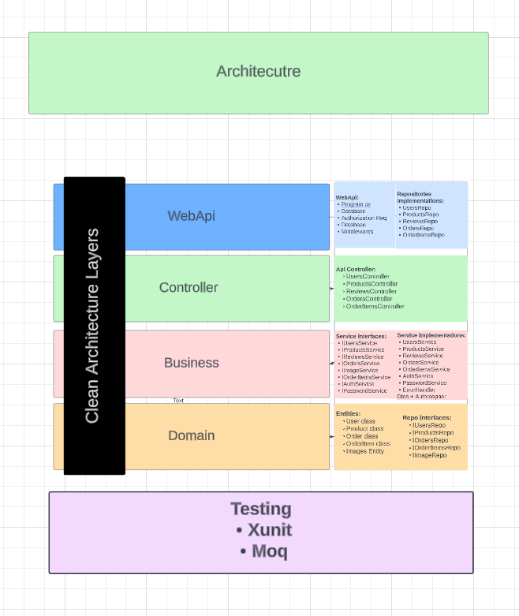
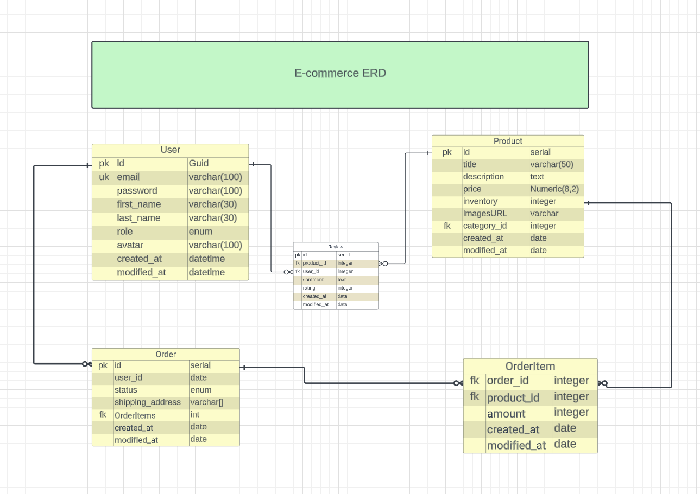
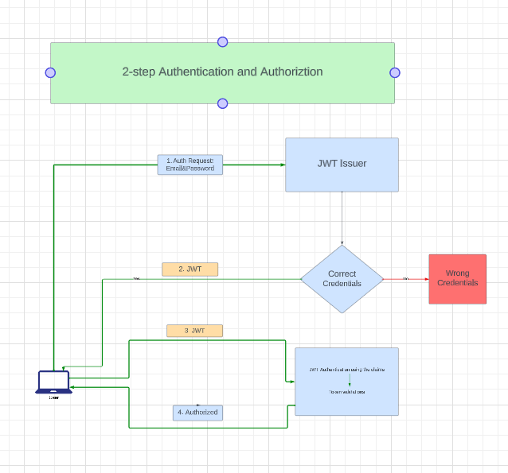

# Fullstack Project-PinnacleMall E-Commerce

### Live site: https://pinnaclemall.netlify.app/

Welcome to my Fullstack E-Commerce project(PinnacleMall)! This application was created with React, Redux, Typescript and MUI on the front-end, and ASP .NET Core 7 on the back-end. The goal is to provide a seamless experience for users, along with robust management system for administrators. The backend API are hosted in Microsoft Azure. The frontend is hosted in netlify and the database is hosted in ElephantSQL.

The project follows CLEAN architecture approach.

## Frontend:

MUI TypeScript, React, Redux Toolkit

## Backend:

ASP .NET Core 7, Entity Framework Core, PostgreSQL

## Features

#### User Functionalities

- User Management:
  Users can register for an account and log in. Users cannot register themselves as admin.
- Browse Products: Users can view all available products, view single product details.
- Add to Cart: Users can add products to a shopping cart and manage the cart.
- Checkout: Users can place orders.

#### Admin Functionalities

- User Management: Admins can view and delete users.
- Product Management: Admins can view, edit, delete, and add new products.

## Requirements

- CLEAN Architecture: The backend follows the CLEAN architecture. See Architecture.md for details.

- Entity-Relationship Diagram:

- Authentication:

## Getting Started

- Clone the Repository: git clone <repository_url>
- Set Up Database: Plan your database schema and set up the PostgreSQL database.
- File Structure:

## Backend Setup:

- Navigate to the backend folder: cd backend
- Restore dependencies: dotnet restore
- Update database: dotnet ef database update
- Run the backend server: dotnet run

## Frontend Setup:

- Navigate to the frontend folder: cd frontend
- Install dependencies: npm install
- Start the frontend development server: npm start
